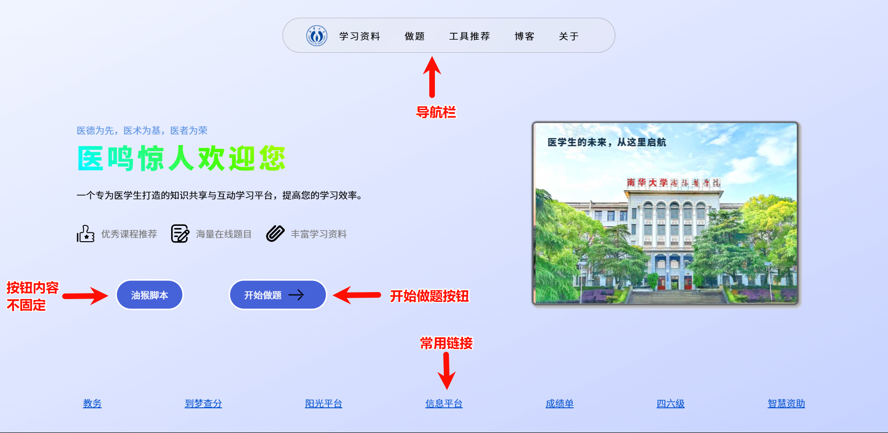
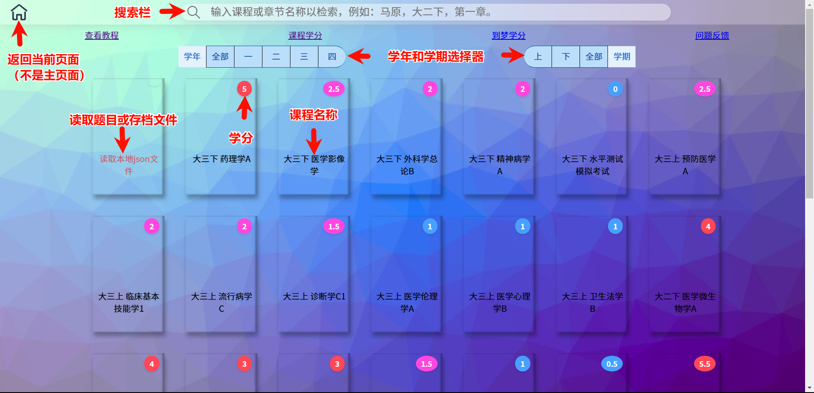
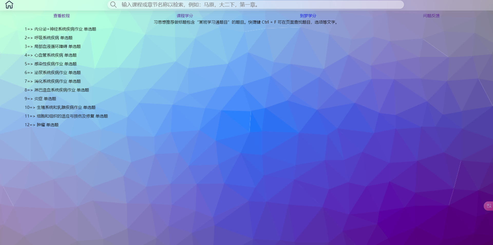
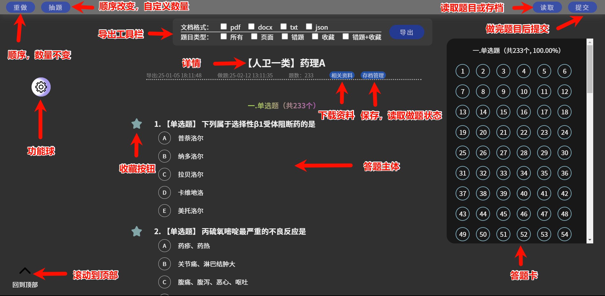
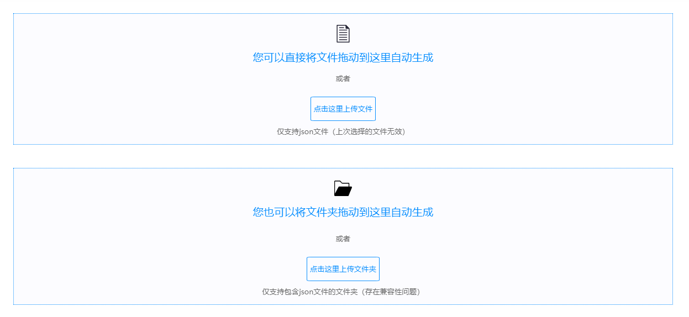
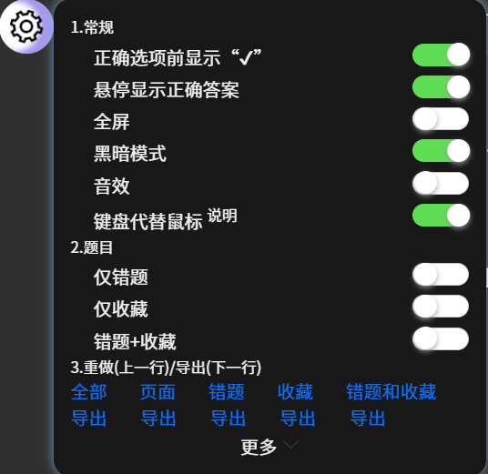
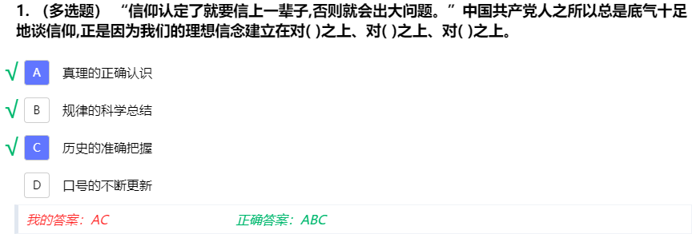
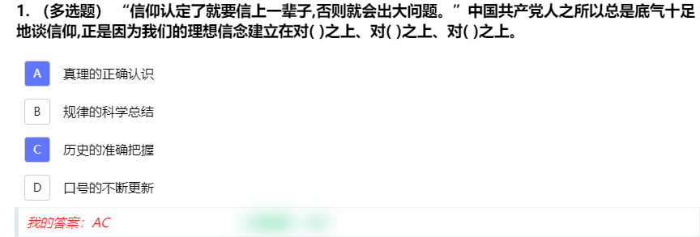
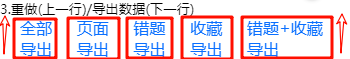
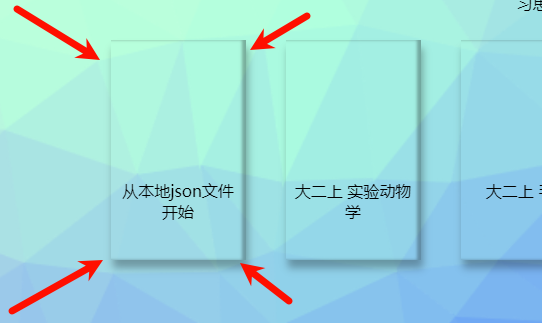

# 一.网站介绍

本网站是一个专为*南华衡医22级临床专业*同学设计的学习平台，旨在帮助临床专业学生更好地学习和复习课程内容。我们的网站提供了丰富的学习资源，包括学习通和智慧树的题目，涵盖了各个临床专业领域的知识点。无论你是准备考试还是想要巩固所学知识，本网站都能为你提供全方位的支持。

最后一次更新：25/2/12。

# 二.基本使用方法

## 1.打开网址

在浏览器输入最新的网址（截至**2025-10-04 07:59:59**，该网址为http://医鸣惊人.icu ，因续费较贵，每年都会转移到新域名），回车等待加载完毕。如果加载失败，请检查您的网络，也有可能是网站挂了。建议使用较高版本的*谷歌*浏览器或者*edge*浏览器，如果您执意使用低版本浏览器和长的像浏览器的浏览器，可能无法正常使用本网站的部分功能。

## 2.选择课程

    网站首页：第一页分为导航栏，两个按钮，底部的常用链接。

    做题选择页面，搜索或者点击筛选器查找结果。

## 3.选择作业

作业来源为学习通，智慧树，或者某些文档。

## 4.做题

点击选项或在输入框输入文字完成题目，之后在网页上方导航栏点击提交。

# 三.实用功能介绍

## 1.课程和作业的搜索栏

- 检索课程：输入“大二”将仅显示大二下的课程（不同专业可能有差别），输入“病理”将仅显示病理学这门课程。
- 检索作业：学习通或智慧树来源的作业将保留其名称，这使得您能**直接复制作业名称**以在本网站检索作业。其它来源的题目名称命名没有规律。

  注意：**检索功能并未完善**，比如您搜索“马克思主义原理”,将不会检索到“大二下 马原”，后续我们会增加对完整课程名称检索的支持。

## 2.练习的导航栏

- 重做：该按钮将按照习题导出顺序生成题目，换言之，每次您通过点击此按钮生成的题目*顺序相同*，选项也相同。重新生成将覆盖您以前的内容。网页每次加载题目默认此顺序。
- 抽题：拖动滑杆确定抽题个数，确定后将抽题，顺序改变。注意：重新生成将覆盖您以前的内容，并且乱序可能造成单选题或多选题**选项引用错误**（如原本正确选项C的内容为选择B，D，乱序后变为正确选项A的内容为选择B，C，这样会引起错误）,还请您多留意。
- 读取：

  格式：特定格式的json文件

  来源：题目：学习通油猴脚本；做题时下载；开发者导出。

  存档：做题时下载。（存档=题目+我的答案）

  分类：文件，文件夹。

  注意：读取的文件夹不要放太多json文件，防止页面卡顿。存档文件只能读取单个文件。
- 提交：提交将提交您的所有题目并**默认隐藏错题的正确答案**，**电脑上鼠标悬停**在正确答案上/**手机上点击正确答案**，即可查看正确答案。可在功能球取消该功能。

## 3.功能球（可以拖动改变位置）

- 常规显示

  ①正确选项前显示“√”：在正确选项前显示“√”，在查看多选题正确答案时就能很直观的看到正确答案，减少看错，看漏选项的可能性。

  

  ②悬停显示正确答案：该功能能帮助您在提交后，查看错题正确答案前思考；也可以当作快刷模式（一道题目也不做，直接提交后，心中想好每一题正确答案后鼠标悬停（电脑）/点击（手机）查看正确答案）。

  

  ③全屏：全屏显示+隐藏导航栏（与F11冲突，请不要同时使用）。

  ④黑暗模式：

  ⑤音效：

  ⑥键盘代替鼠标：
  1.每个题目包裹都能被聚焦,点击任意一个题目包裹后，按 TAb 键可以聚焦下一个题目包裹。

  2.当启用“键盘代替鼠标”后，聚焦一个题目包裹，然后按下“上箭头”将聚焦上一个题目包裹，按下“下箭头”将聚焦下一			个题目包裹，按下“左箭头”将收藏/取消收藏；

  3.键盘映射表
  （从键盘的数字键和字母键开始 【从左向右】）
  (键【左边】为映射后的值，值【右边】为原始输入的值)：
  "A": ["A", "Z", "Q", "1"],
  "B": ["S", "X", "W", "2"],
  "C": ["D", "C", "E", "3"],
  "D": ["F", "V", "R", "4"],
  "E": ["G", "B", "T", "5"],
  "F": ["H", "N", "Y", "6"],
  "G": ["J", "M", "U", "7"],
  "H": ["K", "I", "8"],
  "I": ["L", "O", "9"],
- 题目显示

  仅错题：仅显示错题

  仅收藏：仅显示收藏的题目。题目左边的星星表示收藏，点击收藏后也会在答题卡区域对应的题目标记出来，样式copy from 哔哩哔哩。

  错题+收藏：显示错题和收藏的题目
- 重做/导出数据

  全部：最开始的所有题目。

  页面：为页面上显示的题目。没有抽取题目时与“全部”效果相同，抽取题目后为抽取的题目。

  错题：

  收藏：

  错题+收藏：

  导出：每个导出按钮对应上面的数据，导出格式为json，您之后可以在首页（课程页）或者点击读取生成题目。

  

  

  

## 4.导出工具栏

点击工具栏后等待相关js文件加载完成，然后分别勾选文档格式和题目类型，点击导出即可。注意：导出pdf时需要的中文字体加载时间长甚至失败，而其它格式一般不受影响。

# 四.注意事项

网站可能存在错题，发现后请反馈，谢谢。

你可以按下Ctrl + Shift + R（Windows）或Cmd + Shift + R（Mac）来强制刷新页面，清除缓存。

# 五.更多

* 使用的开源库：sweetalert2，docx，jspdf。

- 问题反馈&功能建议：请您直接到**221寝室**，进行面对面沟♂通♀。功能建议，问题反馈，题库交流，请加入QQ群：532147305。 您也可以通过以下邮箱与我们联系：**chatgpt.usc@gmail.com **。在线文档反馈：[https://f.wps.cn/g/zMpvWD5Q](https://f.wps.cn/g/zMpvWD5Q)
