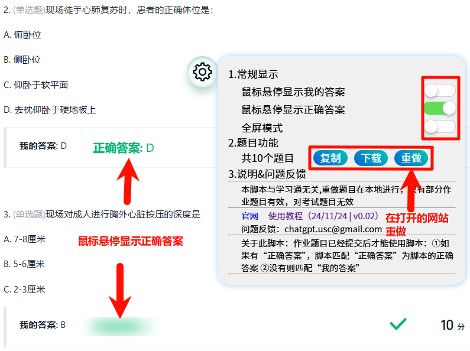

# chaoxingRedo 使用教程

1. 介绍

   ​	chaoxingRedo是在学习通网站上，将您写过的作业优化显示，提供重做功能的油猴脚本。

   ​	为了方便您使用重做功能，您还需要阅读此文档（很久没更新了，有空更）：https://xn--gmqq3isro3y3d.icu/%E4%B9%A0%E9%A2%98/introduce.html  。

   

2. 如何使用

   	**使用前提**：作业提交后，在作业页面点击功能球展开功能面板。

   

   * 鼠标悬停显示我的答案

     提交作业后老师没有开放正确答案，激活此按钮后，您可以不被 我的答案 干扰观看题目，当遇到不会的题目，鼠标悬停在我的答案时会显示我的答案，手机页面逻辑为点击。

   * 鼠标悬停正确我的答案

     提交作业后老师开放正确答案，激活此按钮后，（建议还要 鼠标悬停显示我的答案 按钮），您可以不被 正确答案（和我的答案） 干扰观看题目，，鼠标悬停在正确（和我的）答案时会显示正确（和我的）答案，手机页面逻辑为点击。

   * 全屏模式

     相当于按F11快捷键，让您沉浸式观看题目。

   * 复制

     复制题目为json格式的字符串，需要在指定网站使用。网站：https://xn--gmqq3isro3y3d.icu/%E4%B9%A0%E9%A2%98/exercise.html  。

   * 下载

     下载题目为json格式的文件，需要在指定网站使用。网站：https://xn--gmqq3isro3y3d.icu/%E4%B9%A0%E9%A2%98/exercise.html  。

   * 重做

     打开新页面进入一个网站，脚本通过JavaScript的postMessage方法向被打开的网站传递题目信息，稍等片刻，被打开的网站就会加载您的题目。（您需要阅读如何使用该网站：https://xn--gmqq3isro3y3d.icu/%E4%B9%A0%E9%A2%98/introduce.html）  。

     

3. 注意事项

   **考试时请关闭脚本**。

   本脚本与学习通无关，本脚本让您快速的在您的已经做过的作业页面（文字可看见可复制）使用题目数据（在您的本地运行）。

   本脚本没有窥探您的隐私，脚本没有动态引入其它js文件。

   

4. 问题反馈

   邮箱：chatgpt.usc@gmail.com  。

   

5. Todo

   * [ ] 强制选择“我的答案”，而不是“正确答案”
   * [ ] 导出作业为txt，docx，pdf等
   * [ ] 支持没有写的作业预览
   * [ ] 省略号
   * [ ] 重做时可以获取图片
   * [ ] 重做支持更多题型

